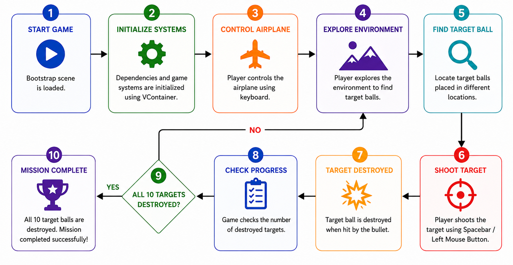

# Airplane Target Shooting Game

## Project Overview
Airplane Target Shooting Game is a Virtual Reality (VR) subject project developed using Unity. The project demonstrates the implementation of airplane navigation and target shooting mechanics within a 3D environment while following a clean and modular architecture.

The player controls an airplane, explores the environment, and locates target balls positioned throughout the scene. The objective is to successfully find and destroy all 10 targets to complete the mission.

---

## Project Objectives
- Implement airplane movement and navigation in a 3D environment.
- Develop a shooting mechanism for target interaction.
- Demonstrate clean software architecture using modern Unity development practices.
- Apply reactive and asynchronous programming concepts in game development.

---

## Technologies Used

### Game Engine
- Unity 2022.3.4f

### Programming Language
- C#

### Libraries & Frameworks
- VContainer (Dependency Injection)
- UniTask (Asynchronous Programming)
- UniRx (Reactive Programming)

---

## Workflow

The overall workflow of the Airplane Target Shooting Game is illustrated in the workflow diagram below.

---

## Features
- Airplane navigation system
- Target shooting mechanism
- 3D environment exploration
- Target destruction and tracking
- Dependency Injection architecture
- Reactive event handling
- Asynchronous task management
- Modular and scalable project structure

---

## Controls

| Action | Key |
|----------|----------|
| Move Forward | W |
| Move Backward | S |
| Move Left | A |
| Move Right | D |
| Shoot | Spacebar / Left Mouse Button |

---

## Project Structure

### Presentation Layer
- User Input Handling
- Camera System
- UI Components

### Gameplay Layer
- Airplane Controller
- Shooting System
- Target Management
- Game Progress Tracking

### Service Layer
- Dependency Injection (VContainer)
- Reactive Event System (UniRx)
- Async Operations (UniTask)

---

## How to Run

1. Open the project in Unity 2022.3.4f.
2. Open the Bootstrap scene.
3. Click Play in the Unity Editor.
4. Navigate the airplane through the environment.
5. Locate and destroy all 10 target balls.

---

## Expected Outcome
The player successfully navigates the airplane through the environment and destroys all 10 target balls, demonstrating the functionality of movement, shooting mechanics, and modular game architecture.

---

## Conclusion
This project showcases the development of a simple airplane target shooting game for a VR subject using Unity. It demonstrates fundamental game development concepts including player control, object interaction, event-driven programming, dependency injection, and asynchronous task handling while maintaining a clean and extensible architecture.